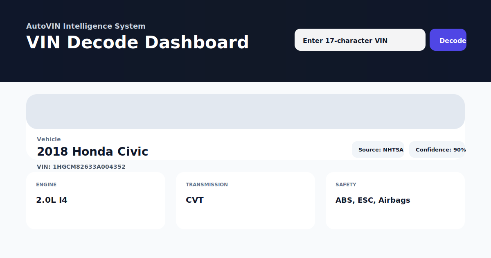

# AutoVIN Intelligence System

[](https://github.com/Nersisiian/AutoVIN-Intelligence-System/actions/workflows/ci.yml)

Production‑ready full‑stack VIN decoding platform with AI‑powered specification prediction, OCR scanning, auction data aggregation, Telegram bot, and mobile client.

## 🚀 Features

- **VIN decoding** – `POST /decode-vin` validates 17‑character VIN and returns structured vehicle data.
- **Multi‑source data fusion** – local WMI/VDS/VIS parsing, NHTSA VPIC API (free), VINDecoder (paid with mock fallback).
- **AI prediction** – RandomForest model estimates trim, engine, transmission, and vehicle class when external APIs fail or return sparse data.
- **OCR VIN scanner** – extract VIN from images using OpenCV + Tesseract (`/scan-vin-image`).
- **Auction data** – scrape Copart & IAAI for lot status, damage, price (`/auction-data`).
- **Telegram bot** – async bot that replies with decoded specs, ML predictions, and auction info.
- **Mobile app** – React Native (Expo) client with camera scanning and API integration.
- **Caching & rate limiting** – Redis (24h TTL) and SlowAPI per‑IP limits.
- **PostgreSQL** – stores decode history.
- **Docker** – one‑command startup with `docker-compose up --build`.
- **CI/CD** – GitHub Actions runs linting (ruff), tests (pytest), and Docker builds.

## 📁 Project Structure

AutoVIN-Intelligence-System/
├── backend/ # FastAPI application
│ ├── app/
│ │ ├── api/ # endpoints (decode, predict, scan, auction)
│ │ ├── core/ # config, db, cache, logging
│ │ ├── ml/ # model training & prediction
│ │ ├── models/ # SQLAlchemy models
│ │ └── services/ # business logic (decode, NHTSA, auction, OCR)
│ ├── tests/ # pytest tests
│ ├── requirements.txt
│ └── pyproject.toml
├── bot/ # Telegram bot (python-telegram-bot)
├── frontend/ # React + Tailwind dashboard
├── mobile-app/ # Expo React Native app
├── docker-compose.yml
├── Dockerfile.backend
├── Dockerfile.bot
└── .github/workflows/ci.yml

```

### Screenshot


### Quick start (one command)
Copy env file:

```bash
cp .env.example .env
```

Run everything:

```bash
docker-compose up --build
```

Then open:
- **Frontend**: `http://localhost:15173`
- **Backend**: `http://localhost:18000/docs`

### API usage
Decode a VIN:

```bash
curl -sX POST "http://localhost:18000/decode-vin" \
  -H "Content-Type: application/json" \
  -d "{\"vin\":\"1HGCM82633A004352\"}" | jq
```

### CLI usage
From the backend container or locally (python installed):

```bash
vin-decoder 1HGCM82633A004352 --pretty
```

If the API is not on localhost:

```bash
AUTOVIN_API_URL=http://localhost:18000 vin-decoder 1HGCM82633A004352 --pretty
```

### Notes on recall / accident history
The API response includes fields (`recalls`, `accident_history`) for future providers. You can plug in additional services in `backend/app/services/`.

